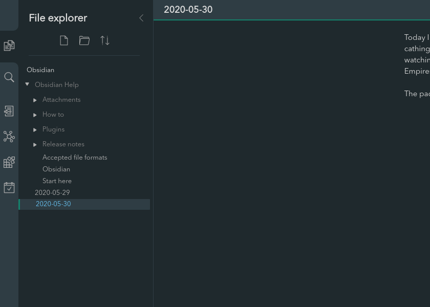

# About
This is a css theme for manjaro users for the awesome note taking application Obsidian! This theme is heavily inspired by another awesome theme for Obsidian that can be found [here](https://github.com/obsidian-ezs/obsidian-ursa).

Theme is still in development to make it fit the entire manjaro feel even better. Enjoy!

# How to install
- Download the obsidian.css file.
- Go to Obsidian, click Settings, select Plugins and make sure you turn on "Custom CSS".
- You need to place the "obsidian.css" in the root folder of your fault (where you main document directory is).
- Restart Obsidian and enjoy.
